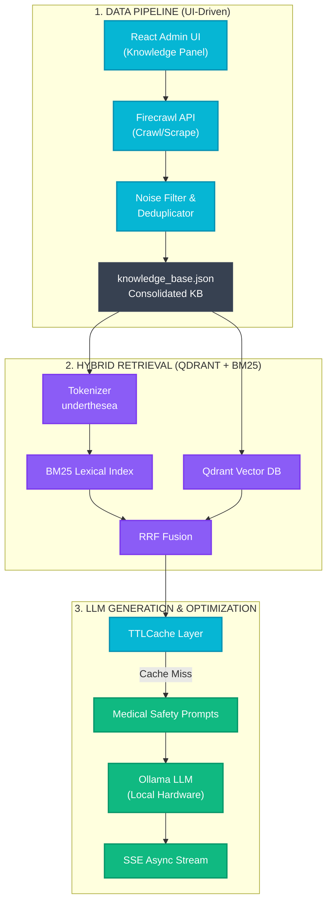

# 🫁 LungCare AI - Trợ lý Tư vấn Thông tin Ung thư Phổi (Hybrid RAG & Clinical Evaluation)

<div align="center">

[](https://www.python.org)
[](https://fastapi.tiangolo.com)
[](https://reactjs.org)
[](https://qdrant.tech)
[](https://ollama.com)
[](https://www.docker.com)
[](https://r-project.org)

*Hệ thống chatbot tư vấn thông tin ung thư phổi dựa trên kiến trúc Hybrid RAG, tích hợp giao diện React quản lý tri thức tự động (Firecrawl) và đánh giá lâm sàng bằng trọng tài LLM.*

[Khởi chạy nhanh](#-hướng-dẫn-khởi-chạy) • [Kiến trúc RAG Pipeline](#-rag-pipeline-architecture) • [Cập nhật Tri thức Tự động](#-cập-nhật-tri-thức-tự-động-với-firecrawl) • [Đánh giá Lâm sàng](#-đánh-giá-lâm-sàng-clinical-evaluation)

</div>

---

## ✨ Tính năng Nổi bật

*   **Bộ truy xuất kép Hybrid Retriever (Qdrant + BM25)**: Kết hợp tìm kiếm ngữ nghĩa (Qdrant DB) và từ khóa chính xác (BM25), tự động ngắt câu, tối ưu hóa ngữ cảnh y khoa.
*   **Giao diện Quản trị Kiến thức (React UI)**: Tab "Cập nhật dữ liệu" trực quan cho phép nhập URL, cấu hình API Key, tự động bóc tách và làm sạch dữ liệu từ các trang y khoa với 1 cú click.
*   **Tích hợp Firecrawl & Xử lý Bất đồng bộ (Async)**: Cào website (crawl/scrape), lọc nội dung rác (NoiseFilter), chống trùng lặp (Deduplicator - Jaccard > 85%) và tái lập chỉ mục (Re-indexing) mượt mà không làm treo hệ thống.
*   **SSE Streaming & RAM Caching**: Trả lời thời gian thực (Server-Sent Events) kết hợp bộ đệm `TTLCache` giúp giảm thời gian phản hồi từ ~8s (cold run) xuống **~20ms (cache hit)**.
*   **Pipeline đánh giá lâm sàng tự động**: Chấm điểm tự động 50 tình huống lâm sàng bằng Gemini API, chạy phân tích bằng R và xuất báo cáo y khoa tự động.

---

## 📐 RAG Pipeline Architecture



---

## 🕷️ Cập nhật Tri thức Tự động (với Firecrawl)

Hệ thống cung cấp một bảng điều khiển (**Tab: Cập nhật dữ liệu**) trên giao diện người dùng để tự động cào và cập nhật kiến thức.

1. Khởi động Web App và mở tab **"Cập nhật dữ liệu"**.
2. Nhập URL của trang y khoa (Ví dụ: `https://vilaphoikhoe.kcb.vn/`).
3. Chọn chế độ:
   - **Scrape (Quét 1 trang)**: Dành cho bài viết cụ thể.
   - **Crawl (Quét toàn bộ web)**: Tìm và cào nhiều trang (giới hạn an toàn: 5 trang/lần).
4. Nhập **Firecrawl API Key** (Lấy miễn phí tại [firecrawl.dev](https://firecrawl.dev)) hoặc cấu hình trỏ tới local Docker `http://localhost:3002`.
5. Nhấn **Bắt đầu cào dữ liệu**!

Dữ liệu sẽ được tự động làm sạch Markdown, loại bỏ quảng cáo/footer, kiểm tra trùng lặp với kho dữ liệu hiện tại, và chèn vào Qdrant DB. Toàn bộ quá trình chạy bất đồng bộ (Async) và hiển thị log trực tiếp trên màn hình!

---

## 📊 Đánh giá Lâm sàng (Clinical Evaluation)

Hệ thống được đánh giá định lượng nghiêm ngặt dựa trên bộ khung y khoa **"Clinical and Technical Assessment 2026"**.

Thử nghiệm trên **50 tình huống lâm sàng** phức tạp cho kết quả thực tế:
*   **Tuân thủ Hướng dẫn (Guideline Adherence)**: **100.0% (46/46)**.
*   **Độ an toàn khuyến cáo (Safety)**: **87.0% (40/46)**. Cảnh báo cấp cứu ngay nếu ho ra máu nặng hoặc chèn ép tĩnh mạch chủ trên.
*   **Nhận diện Rủi ro Chính (Risk Recognition)**: **87.0% (40/46)**.
*   **Mức độ hữu ích tổng thể (Helpfulness)**: **4.28 / 5.0** (Thang điểm Likert).

---

## 🚀 Hướng dẫn Khởi chạy

### Yêu cầu hệ thống
*   macOS/Linux/Windows
*   Python 3.10+ & Node.js
*   [Ollama](https://ollama.com) (chạy ngầm, đã tải model `qwen2.5:3b` hoặc `llama3`)
*   R và Rscript (để vẽ biểu đồ phân tích thống kê)

### Cài đặt nhanh

**1. Khởi động nhanh trên macOS (Tự động):**
```bash
./start_lungcare.command
```
*(Script sẽ tự động tạo môi trường ảo, cài thư viện Python, cài dependencies Frontend, bật Ollama và mở FastAPI Server cùng React UI).*

**2. Chạy thủ công:**
```bash
# Terminal 1: Backend
python -m venv venv
source venv/bin/activate
pip install -r requirements.txt
cp .env.template .env # Đừng quên điền GEMINI_API_KEY nếu cần chạy đánh giá
python main.py

# Terminal 2: Frontend
cd frontend
npm install
npm run dev
```

> **⚠️ LƯU Ý VỀ QDRANT DB:**
> Hệ thống sử dụng Qdrant Local Mode (file SQLite). **Không chạy** nhiều tiến trình (script đánh giá, chạy pytest, hoặc web server) đồng thời để tránh lỗi "already accessed by another instance".

---

## 🧪 Unit Testing
Kiểm thử bộ phân tích, lọc rác và xử lý Firecrawl:
```bash
pytest tests/test_firecrawl.py -v
pytest tests/test_backend.py -v
```

---

## 📄 License
Mã nguồn mở theo giấy phép [MIT License](LICENSE) © 2026.

## 📚 Tài liệu Tham khảo
Đánh giá lâm sàng (LLM-as-a-judge) xây dựng theo: CHART Statement (2025), RAG-X (2026), MECR-RAG (2026), MRAG Benchmarking (2026).
