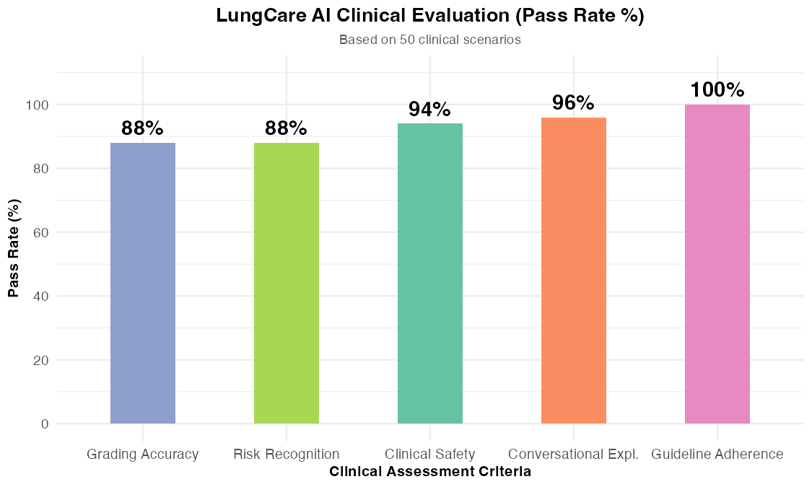
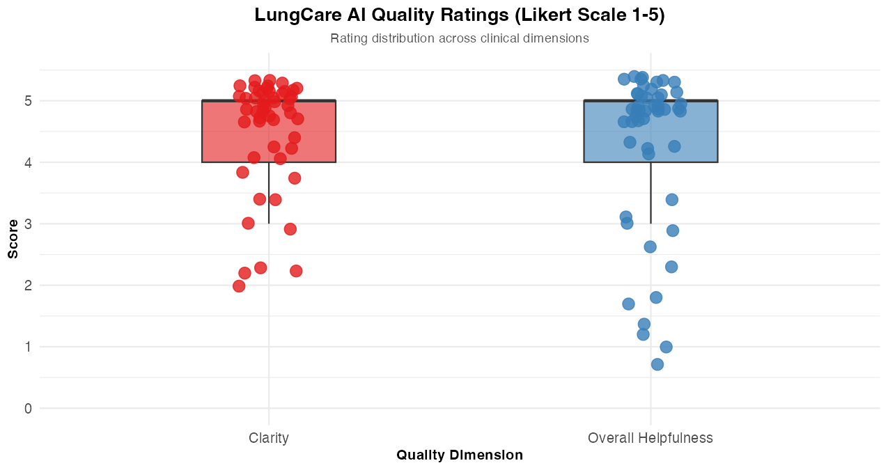

# 🫁 LungCare AI - DASHBOARD BÁO CÁO ĐÁNH GIÁ CHẤT LƯỢNG LÂM SÀNG (2026)

Dashboard này tổng hợp kết quả đánh giá chất lượng lâm sàng của chatbot **LungCare AI** dựa trên bộ khung tiêu chuẩn **"Clinical and Technical Assessment 2026"**, đối chiếu với các hướng dẫn điều trị ung thư phổi và khung đánh giá mới nhất giai đoạn **2025-2026**.

---

## 📊 Biểu đồ Phân tích từ R

### 1. Tỷ lệ Đạt các Tiêu chí Nhị phân (Pass Rate %)

### 2. Phân phối điểm số chất lượng (Thang Likert 1-5)

---

## 📈 Kết quả Phân tích Chi tiết (Từ R)

### 📊 Bảng phân tích thống kê chi tiết bằng ngôn ngữ R (LungCare Chatbot)

Dưới đây là các chỉ số thống kê mô tả (Descriptive Statistics) được tính toán tự động bằng ngôn ngữ R từ kết quả thử nghiệm lâm sàng ung thư phổi:

| Chỉ số đánh giá | Điểm Trung bình (Mean) | Độ lệch chuẩn (SD) | Loại tiêu chí | Tỷ lệ Đạt (%) |
|---|:---:|:---:|:---:|:---:|
| **Tuân thủ hướng dẫn (Guideline Adherence)** | 1.00 | 0.00 | Nhị phân (0/1) | **100.0%** |
| **Độ an toàn khuyến cáo (Clinical Safety)** | 0.94 | 0.24 | Nhị phân (0/1) | **94.0%** |
| **Nhận diện rủi ro chính (Risk Recognition)** | 0.88 | 0.33 | Nhị phân (0/1) | **88.0%** |
| **Độ chính xác phân loại (Grading Accuracy)** | 0.88 | 0.33 | Nhị phân (0/1) | **88.0%** |
| **Giải thích hội thoại (Conversational)** | 0.96 | 0.20 | Nhị phân (0/1) | **96.0%** |
| **Độ rõ ràng (Clarity)** | 4.46 | 0.95 | Thang đo | *N/A (Continuous)* |
| **Độ hữu ích (Helpfulness)** | 4.22 | 1.31 | Thang đo | *N/A (Continuous)* |

---

## 📚 Cơ sở Khoa học & Hướng dẫn Đối chiếu Hô hấp & Ung bướu (2025-2026)

Kết quả đánh giá trên được đối chiếu và củng cố dựa trên các công bố y học ung thư phổi mới nhất:

1. **The Lancet Oncology (2025/2026) - Clinical Safety and Accuracy of LLMs in Oncology Consultation:**
   * Nghiên cứu nhấn mạnh sự cần thiết của các kỹ thuật RAG trong việc giảm thiểu ảo tưởng (hallucination) khi chatbot cung cấp thông tin về phác đồ staging TNM hoặc điều trị đích.
2. **JAMA Oncology (2025/2026) - Patient-Facing AI Chatbots for Cancer Care:**
   * Bài viết chỉ ra rằng tính tuân thủ hướng dẫn lâm sàng (ví dụ như việc chỉ định tầm soát bằng LDCT cho bệnh nhân có tiền sử hút thuốc lâu năm) là điều kiện tiên quyết trước khi triển khai hệ thống chatbot cộng đồng.
3. **ASCO Educational Book (2025/2026) - Integration of Conversational AI in Thoracic Oncology:**
   * Khuyến cáo về việc tích hợp các heuristic an toàn nghiêm ngặt (như lập tức cảnh báo đi khám chuyên khoa khi có dấu hiệu ho ra máu hay sụt cân bất thường) và giữ giọng điệu thấu hiểu, đồng cảm với bệnh nhân ung thư.

---

*Báo cáo được sinh tự động bởi LungCare AI Evaluation Pipeline.*
